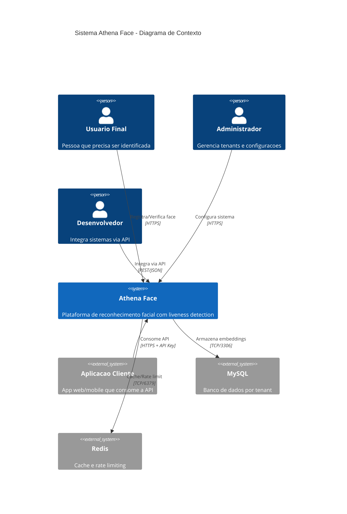
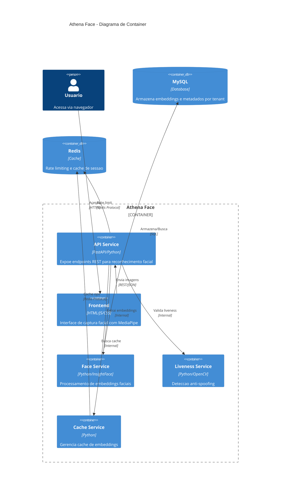
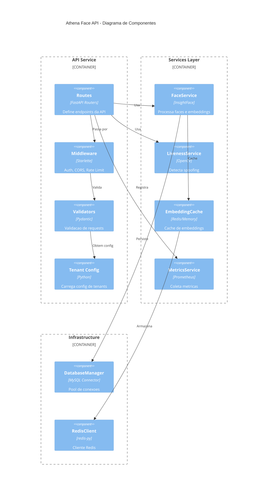
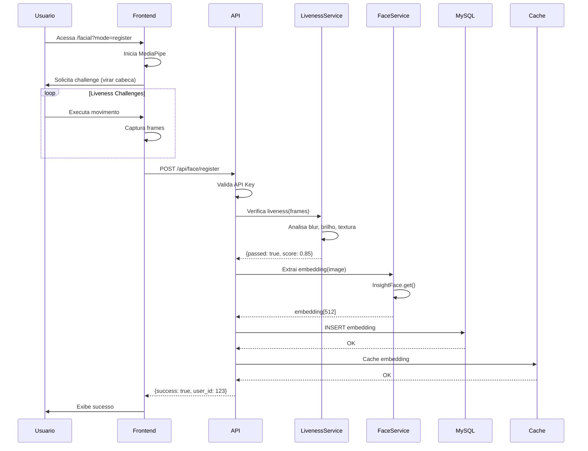
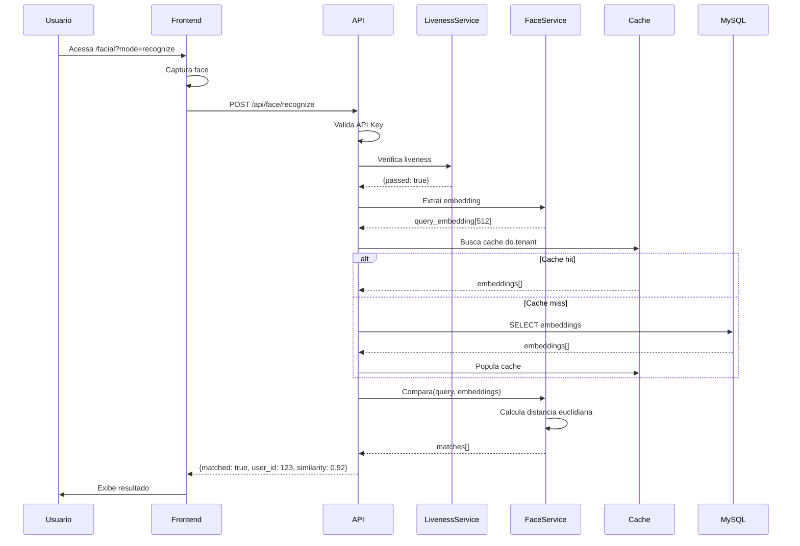
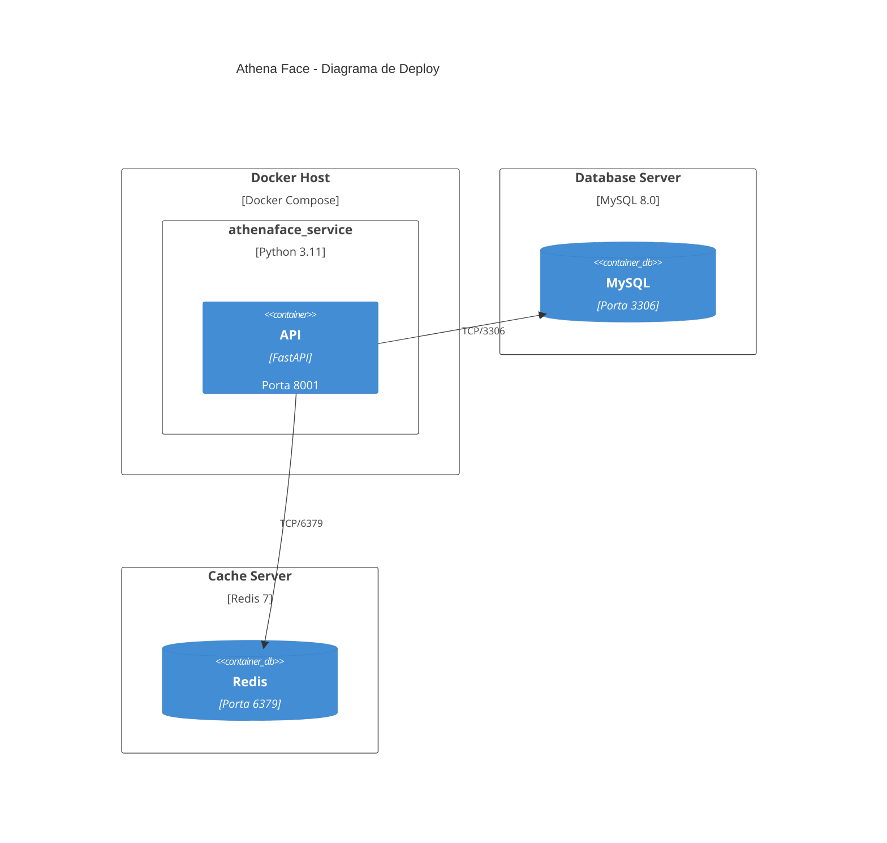

# Arquitetura C4 - Athena Face

O modelo C4 (Context, Containers, Components, Code) oferece uma visao hierarquica da arquitetura do sistema.

## 1. Diagrama de Contexto

Visao de alto nivel mostrando o sistema e suas interacoes externas.

### Descricao dos Atores

| Ator | Descricao | Interacao |
|------|-----------|-----------|
| **Usuario Final** | Pessoa que passa pelo processo de verificacao facial | Captura de face via webcam |
| **Administrador** | Responsavel pela gestao de tenants e API keys | Painel administrativo |
| **Desenvolvedor** | Integra o Athena Face em aplicacoes | API REST |
| **Aplicacao Cliente** | Sistema externo que consome a API | Webhooks, callbacks |

---

## 2. Diagrama de Container

Mostra os principais containers/servicos que compoem o sistema.

### Descricao dos Containers

| Container | Tecnologia | Responsabilidade |
|-----------|------------|------------------|
| **API Service** | FastAPI | Roteamento, autenticacao, orquestracao |
| **Frontend** | Vanilla JS + MediaPipe | Captura facial, challenges de liveness |
| **Face Service** | InsightFace (buffalo_l) | Extracao de embeddings 512D |
| **Liveness Service** | OpenCV + NumPy | Analise anti-spoofing |
| **Cache Service** | Redis/In-Memory | Cache de embeddings para performance |
| **MySQL** | MySQL 8.0 | Persistencia por tenant |
| **Redis** | Redis 7 | Cache distribuido e rate limiting |

---

## 3. Diagrama de Componentes

Detalha os componentes internos do API Service.

### Componentes Principais

#### API Layer
| Componente | Arquivo | Funcao |
|------------|---------|--------|
| Routes | `src/main.py` | Endpoints REST |
| Middleware | `src/middleware/` | Auth, CORS, Rate Limit |
| Validators | Pydantic Models | Validacao de entrada |

#### Services Layer
| Componente | Arquivo | Funcao |
|------------|---------|--------|
| FaceService | `src/services/face_service.py` | Embeddings faciais |
| LivenessService | `src/services/liveness_service.py` | Anti-spoofing |
| EmbeddingCache | `src/services/embedding_cache.py` | Cache |
| MetricsService | `src/services/metrics_service.py` | Prometheus |

---

## 4. Diagrama de Sequencia - Fluxo de Registro

---

## 5. Diagrama de Sequencia - Fluxo de Reconhecimento

---

## 6. Diagrama de Deploy

### Requisitos de Infraestrutura

| Componente | Minimo | Recomendado |
|------------|--------|-------------|
| **CPU** | 2 cores | 4+ cores |
| **RAM** | 4 GB | 8+ GB |
| **Disco** | 20 GB | 50+ GB SSD |
| **GPU** | Opcional | NVIDIA (CUDA) |

---

## 7. Decisoes Arquiteturais

### ADR-001: Modelo InsightFace buffalo_l
- **Contexto**: Necessidade de modelo preciso e rapido
- **Decisao**: Usar buffalo_l (embeddings 512D)
- **Consequencias**: +99% accuracy, ~50ms por face

### ADR-002: Multi-Tenancy via API Key
- **Contexto**: Multiplos clientes isolados
- **Decisao**: Cada tenant tem API Key e banco separado
- **Consequencias**: Isolamento total, configuracao flexivel

### ADR-003: Liveness no Frontend + Backend
- **Contexto**: Prevenir spoofing
- **Decisao**: Challenges no frontend, validacao no backend
- **Consequencias**: UX fluida, seguranca em camadas

### ADR-004: Cache de Embeddings
- **Contexto**: Performance em buscas 1:N
- **Decisao**: Cache em Redis ou memoria
- **Consequencias**: Latencia <100ms para 10k faces
