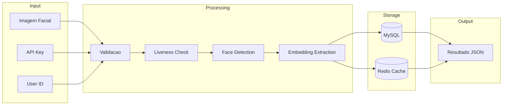
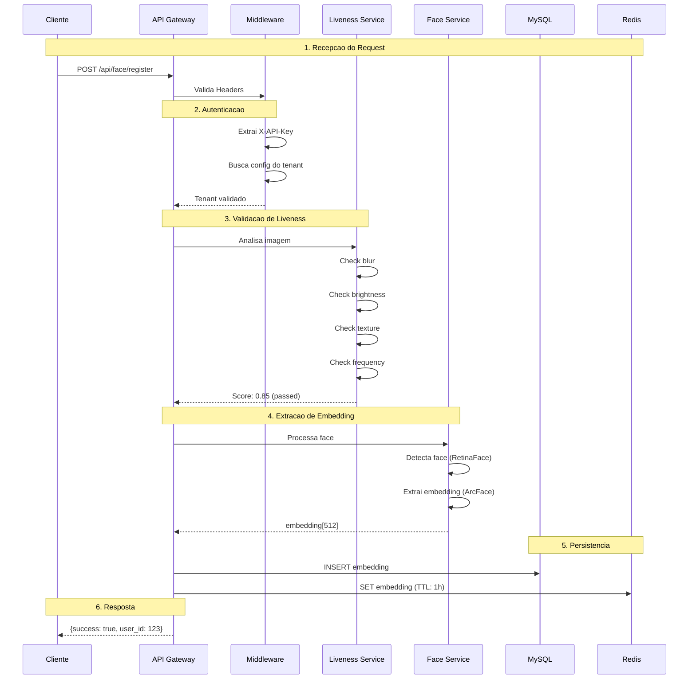
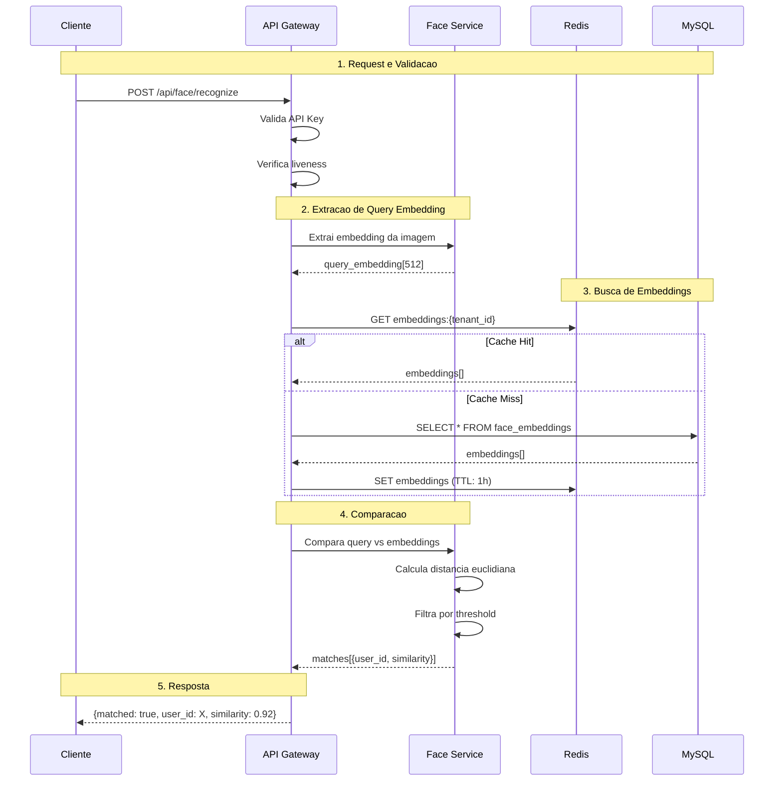
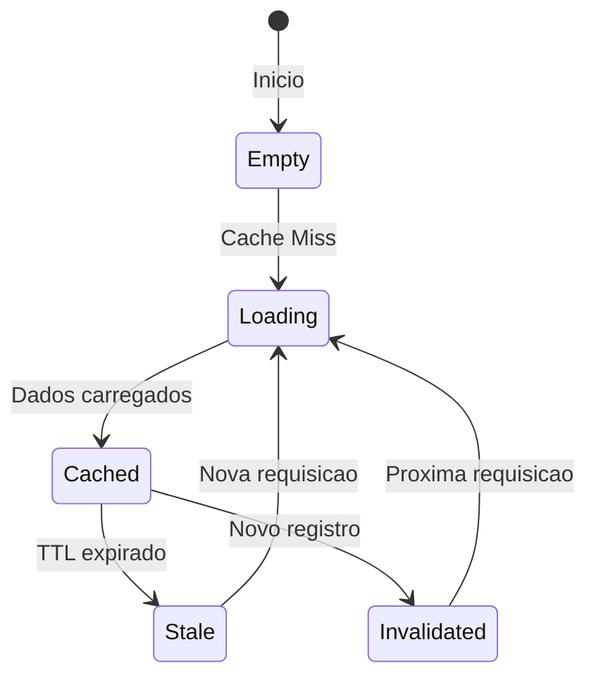
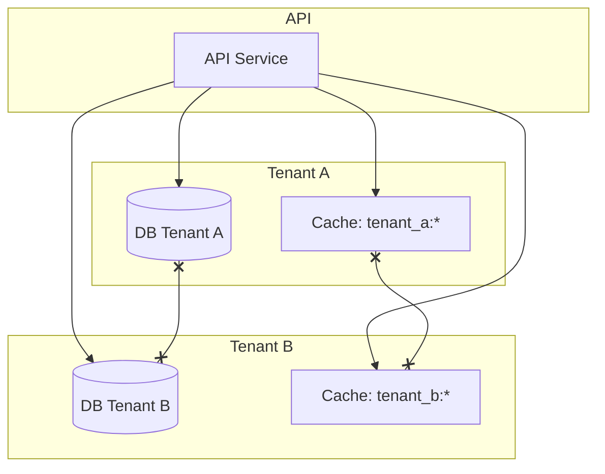
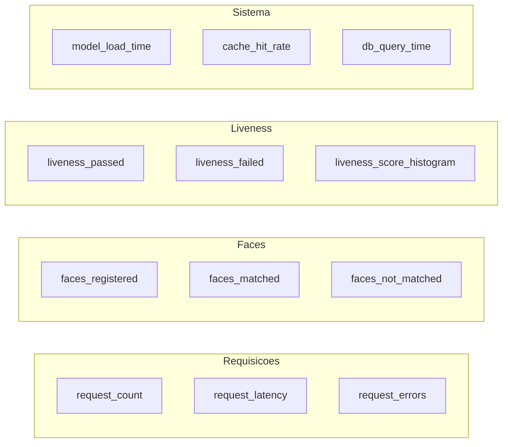
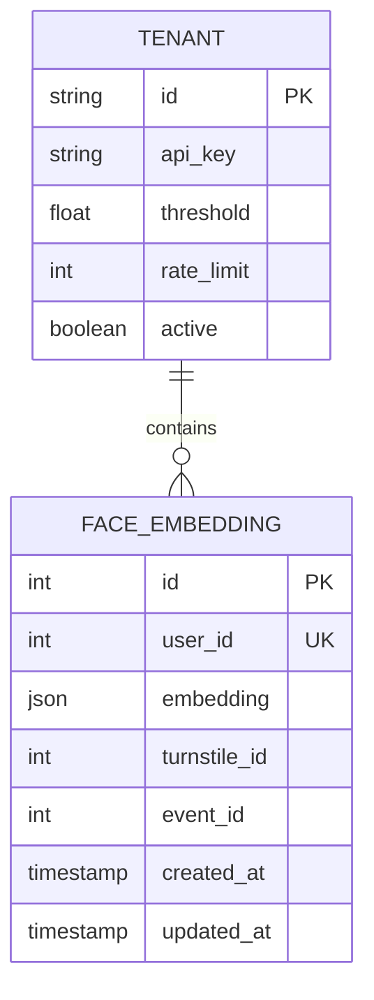

# Fluxo de Dados - Athena Face

Este documento descreve como os dados fluem atraves do sistema.

## Visao Geral



## Fluxo de Registro



## Fluxo de Reconhecimento



## Estrutura de Dados

### Embedding Facial

```json
{
  "id": 1,
  "user_id": 123,
  "embedding": [0.123, -0.456, 0.789, ...],  // 512 floats
  "turnstile_id": 1,
  "event_id": 100,
  "created_at": "2026-01-15T10:00:00Z",
  "updated_at": "2026-01-15T10:00:00Z"
}
```

### Resultado de Liveness

```json
{
  "passed": true,
  "score": 0.85,
  "details": {
    "blur": {
      "passed": true,
      "variance": 156.3,
      "threshold": 100.0
    },
    "brightness": {
      "passed": true,
      "mean": 128,
      "std": 45,
      "min_threshold": 50,
      "max_threshold": 200
    },
    "color": {
      "passed": true,
      "std": 42.5,
      "saturation_mean": 0.35
    },
    "texture": {
      "passed": true,
      "moire_score": 0.08,
      "threshold": 0.15
    },
    "frequency": {
      "passed": true,
      "energy_ratio": 1.5,
      "threshold": 1.0
    }
  }
}
```

### Request de Registro

```
POST /api/face/register
Content-Type: multipart/form-data

image: <binary>
user_id: 123
turnstile_id: 1 (opcional)
event_id: 100 (opcional)
```

### Response de Registro

```json
{
  "success": true,
  "message": "Face cadastrada com sucesso",
  "data": {
    "user_id": 123,
    "face_quality": 0.92,
    "liveness_score": 0.85,
    "registered_at": "2026-01-15T10:00:00Z"
  }
}
```

## Ciclo de Vida do Cache



### Estrategia de Cache

| Evento | Acao |
|--------|------|
| GET embeddings | Busca cache, fallback para DB |
| POST register | Invalida cache do tenant |
| TTL expira | Remove entrada do cache |

## Isolamento de Dados



**Garantias**:
- Cada tenant tem banco separado
- Cache usa prefixo por tenant
- Impossivel cruzar dados entre tenants

## Metricas Coletadas



## Diagrama de Entidade-Relacionamento



## Suporte

- **Email**: jefferson@jeffersonpl.dev
- **Issues**: https://github.com/Jeffersonpl/athena-face/issues
