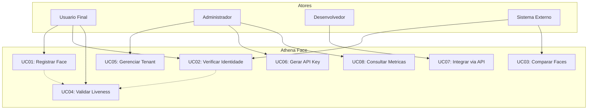
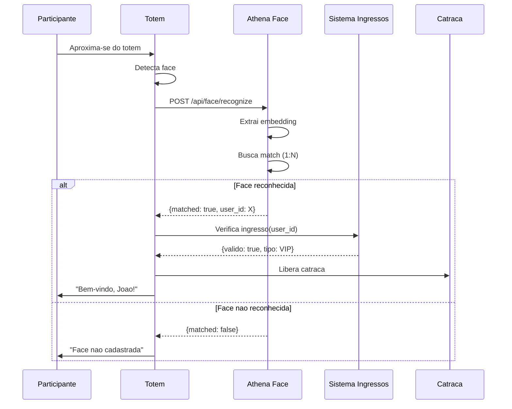
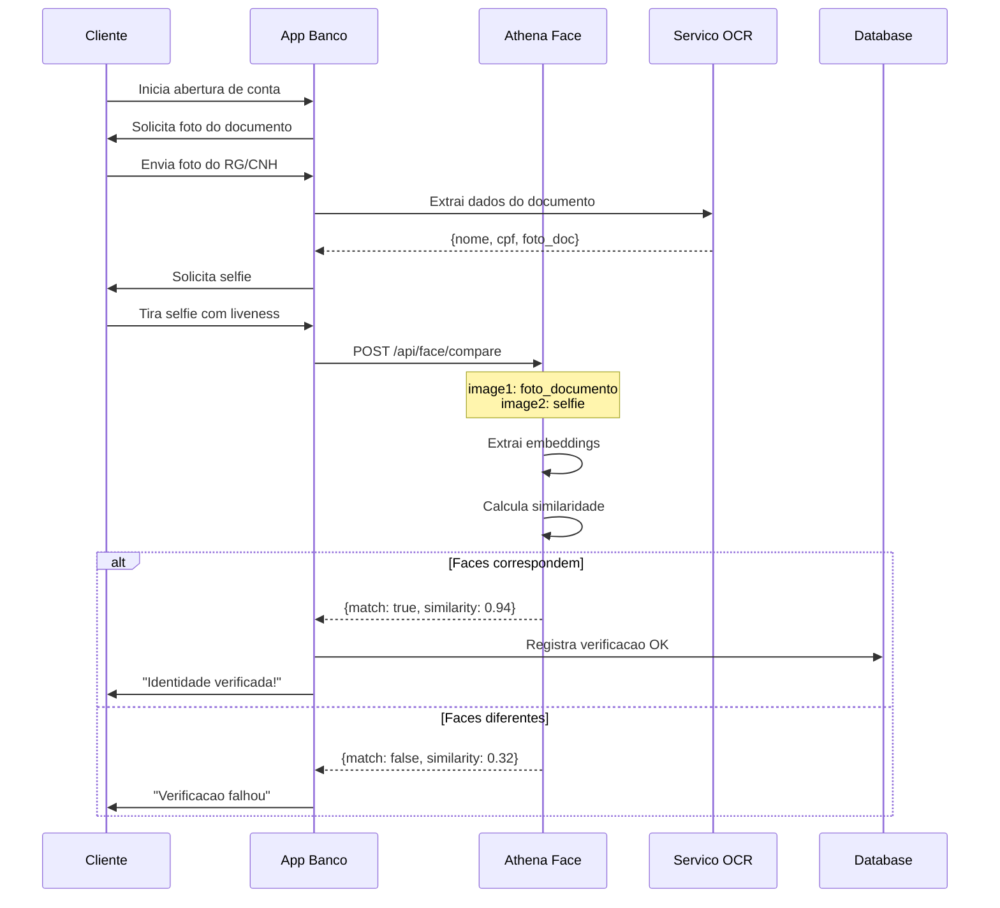
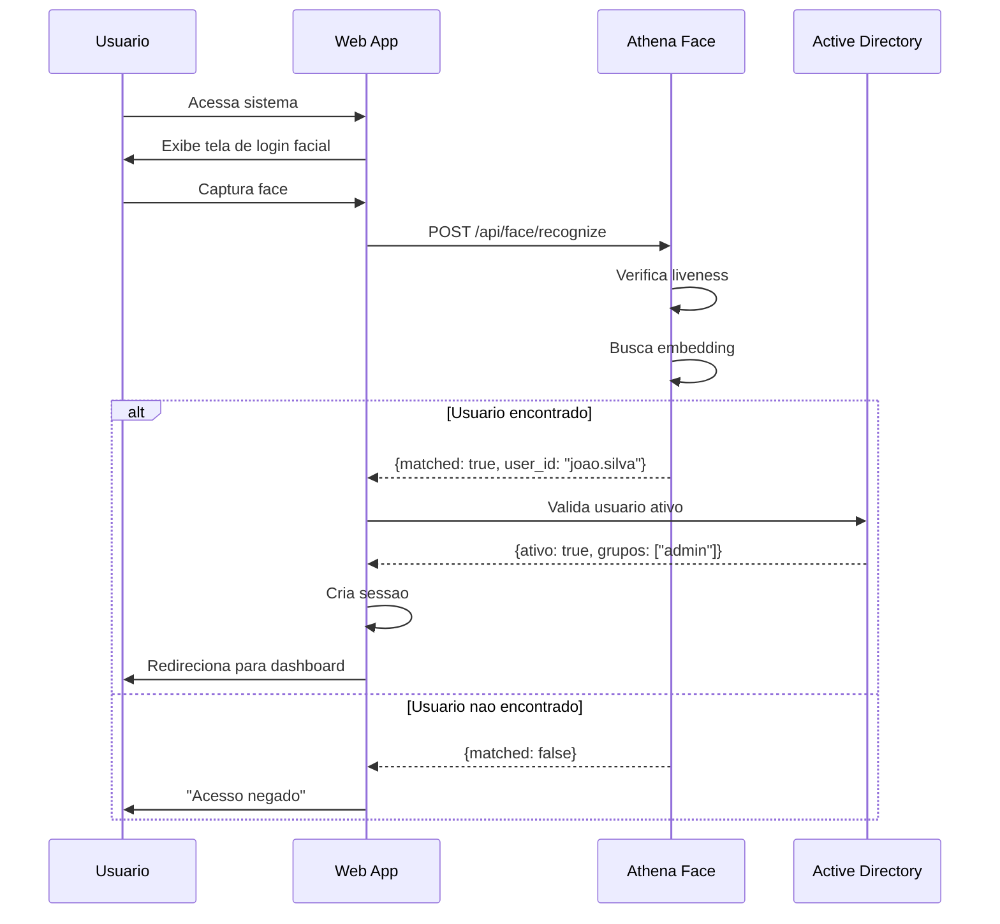
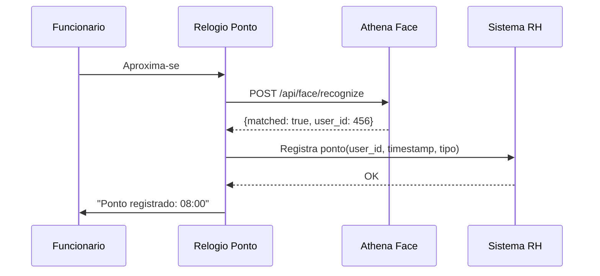
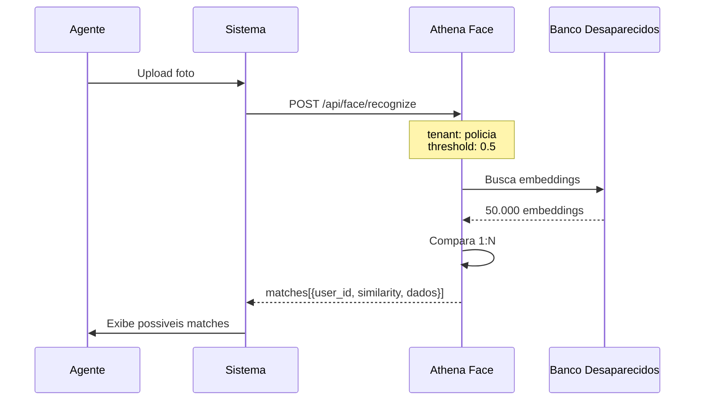
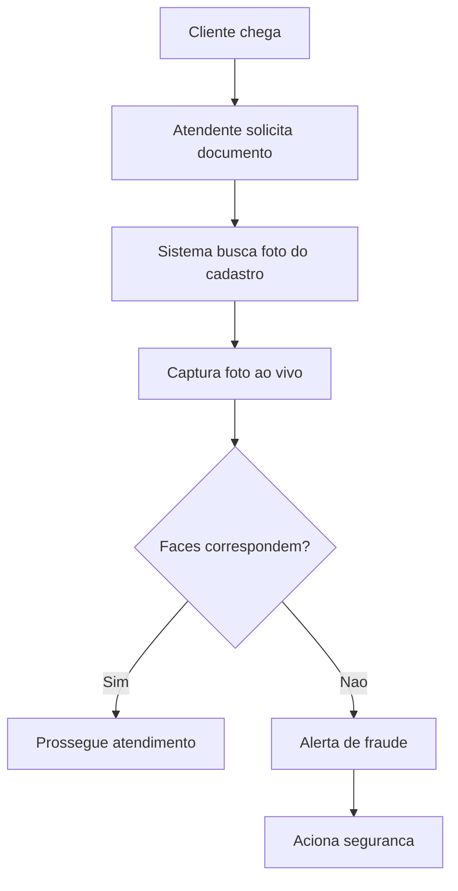

# Casos de Uso - Athena Face

Este documento descreve os principais casos de uso do sistema Athena Face.

## Diagrama de Casos de Uso

---

## UC01: Controle de Acesso em Eventos

### Descricao
Sistema de controle de acesso para eventos utilizando reconhecimento facial para validar a entrada de participantes.

### Atores
- **Participante**: Pessoa que deseja entrar no evento
- **Operador**: Funcionario que monitora o acesso
- **Sistema de Ingressos**: Sistema externo que gerencia vendas

### Pre-condicoes
- Participante comprou ingresso e fez pre-cadastro facial
- Totem/camera configurado na entrada

### Fluxo Principal

### Fluxos Alternativos

**FA01 - Liveness falha**
1. Sistema detecta possivel spoofing
2. Solicita nova captura
3. Apos 3 tentativas, aciona operador

**FA02 - Ingresso invalido**
1. Face reconhecida mas ingresso invalido
2. Direciona para bilheteria

### Pos-condicoes
- Acesso registrado no log de auditoria
- Metrica de tempo de verificacao coletada

### Requisitos Nao-Funcionais
- Tempo de resposta: < 2 segundos
- Disponibilidade: 99.9%
- Taxa de falsos positivos: < 0.1%

---

## UC02: Verificacao de Identidade (KYC)

### Descricao
Processo de Know Your Customer para verificar a identidade de usuarios em onboarding de servicos financeiros.

### Atores
- **Cliente**: Pessoa abrindo conta
- **Sistema Bancario**: Plataforma do banco
- **Compliance**: Equipe de conformidade

### Pre-condicoes
- Cliente possui documento com foto
- Aplicativo do banco instalado

### Fluxo Principal

### Metricas de Sucesso
| Metrica | Meta |
|---------|------|
| Taxa de aprovacao | > 85% |
| Falsos positivos | < 0.01% |
| Tempo medio | < 30s |

---

## UC03: Autenticacao Biometrica

### Descricao
Substituir senha por reconhecimento facial para login em sistemas.

### Atores
- **Usuario**: Funcionario da empresa
- **Sistema Corporativo**: ERP, CRM, etc.

### Fluxo Principal

### Requisitos de Seguranca
- MFA opcional (face + token)
- Bloqueio apos 5 tentativas falhas
- Log de todas as tentativas

---

## UC04: Registro de Ponto por Face

### Descricao
Sistema de registro de ponto utilizando reconhecimento facial.

### Fluxo Principal

### Regras de Negocio
- Intervalo minimo entre registros: 1 minuto
- Tolerancia de horario: +/- 10 minutos
- Foto armazenada para auditoria

---

## UC05: Busca de Pessoas Desaparecidas

### Descricao
Busca em banco de dados de pessoas desaparecidas a partir de foto.

### Fluxo Principal

---

## UC06: Anti-Fraude em Atendimento

### Descricao
Verificar se a pessoa no atendimento e a mesma do cadastro.

### Fluxo

---

## Matriz de Casos de Uso x Endpoints

| Caso de Uso | Endpoint Principal | Metodo |
|-------------|-------------------|--------|
| Controle de Acesso | `/api/face/recognize` | POST |
| KYC | `/api/face/compare` | POST |
| Autenticacao | `/api/face/recognize` | POST |
| Registro de Ponto | `/api/face/recognize` | POST |
| Busca Desaparecidos | `/api/face/recognize` | POST |
| Anti-Fraude | `/api/face/compare` | POST |
| Cadastro Inicial | `/api/face/register` | POST |

---

## Requisitos por Caso de Uso

| Caso de Uso | Liveness | Threshold | SLA |
|-------------|----------|-----------|-----|
| Controle Acesso | Basico | 0.4 | 2s |
| KYC | Avancado | 0.5 | 5s |
| Autenticacao | Basico | 0.4 | 1s |
| Registro Ponto | Opcional | 0.4 | 2s |
| Busca Desaparecidos | Nao | 0.5 | 10s |
| Anti-Fraude | Avancado | 0.45 | 3s |
