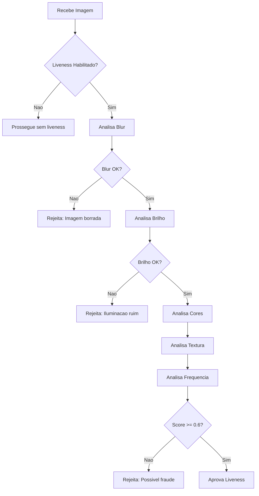

# Liveness Detection - Athena Face

O Liveness Detection (deteccao de vivacidade) e um mecanismo anti-spoofing que verifica se a face capturada pertence a uma pessoa real e presente.

## Por que Liveness e Importante?

Sem liveness detection, atacantes podem usar:
- Fotos impressas
- Telas de celular/tablet
- Videos pre-gravados
- Mascaras 2D

## Como Funciona

O Athena Face usa uma abordagem em duas camadas:

### 1. Challenges no Frontend

O usuario deve completar movimentos aleatorios:

| Challenge | Descricao | Tempo |
|-----------|-----------|-------|
| LEFT | Virar cabeca para esquerda | 500ms min |
| RIGHT | Virar cabeca para direita | 500ms min |
| UP | Inclinar cabeca para cima | 500ms min |
| DOWN | Inclinar cabeca para baixo | 500ms min |
| CENTER | Olhar para frente | 500ms min |
| CLOSER | Aproximar-se da camera | 500ms min |
| FARTHER | Afastar-se da camera | 500ms min |

**Sequencia padrao**: 3 challenges aleatorios + CENTER final

### 2. Analise no Backend

Tecnicas de analise de imagem:

| Tecnica | Peso | O que detecta |
|---------|------|---------------|
| **Blur Detection** | 20% | Imagens desfocadas/de tela |
| **Brightness Analysis** | 15% | Iluminacao artificial |
| **Color Distribution** | 15% | Cores artificiais/saturadas |
| **Texture Analysis** | 25% | Padroes de moire (telas) |
| **Frequency Domain** | 25% | Ruidos de compressao |

### Score Final

```
score = (blur * 0.20) + (brightness * 0.15) + (color * 0.15) + (texture * 0.25) + (frequency * 0.25)

Aprovado: score >= 0.6 AND checks criticos passaram
```

## Configuracao

### Variaveis de Ambiente

```bash
# Habilitar/desabilitar liveness
ENABLE_LIVENESS_CHECK=true

# Thresholds de deteccao
LIVENESS_BLUR_THRESHOLD=100.0       # Variance minima do Laplacian
LIVENESS_BRIGHTNESS_MIN=50          # Brilho minimo (0-255)
LIVENESS_BRIGHTNESS_MAX=200         # Brilho maximo (0-255)

# Deteccao de blink (opcional)
LIVENESS_BLINK_ENABLED=true
LIVENESS_BLINK_MIN_COUNT=2          # Minimo de piscadas

# Deteccao de movimento
LIVENESS_MOTION_ENABLED=true
LIVENESS_MOTION_MIN_FRAMES=10       # Frames para analise

# Analise de textura
LIVENESS_TEXTURE_ENABLED=true

# Timeout
LIVENESS_CHALLENGE_TIMEOUT_MS=10000  # Tempo maximo para completar
LIVENESS_MIN_CHALLENGE_TIME_MS=500   # Tempo minimo por challenge
```

## Fluxo de Verificacao



## Detalhes das Tecnicas

### Blur Detection (Laplacian Variance)

Detecta imagens de baixa qualidade ou capturadas de telas.

```python
# Calcula variancia do Laplacian
gray = cv2.cvtColor(image, cv2.COLOR_BGR2GRAY)
laplacian = cv2.Laplacian(gray, cv2.CV_64F)
variance = laplacian.var()

# variance > 100 = imagem nitida
# variance < 50 = provavelmente foto de tela
```

### Moire Pattern Detection (FFT)

Detecta padroes de interferencia de telas LCD/LED.

```python
# Analisa espectro de frequencia
f = np.fft.fft2(gray)
fshift = np.fft.fftshift(f)
magnitude = np.abs(fshift)

# Picos regulares = padrao de moire = tela
```

### Brightness/Contrast Analysis

Verifica iluminacao natural vs artificial.

```python
mean_brightness = gray.mean()
std_brightness = gray.std()

# Imagem natural: 50 < mean < 200, std > 20
# Imagem de tela: brilho uniforme, baixo contraste
```

## Ajustes por Caso de Uso

### Controle de Acesso (Baixa Seguranca)

```bash
ENABLE_LIVENESS_CHECK=true
LIVENESS_BLUR_THRESHOLD=50.0        # Mais tolerante
LIVENESS_BLINK_ENABLED=false        # Desabilita blink
LIVENESS_MOTION_ENABLED=false       # Desabilita movimento
```

### KYC Bancario (Alta Seguranca)

```bash
ENABLE_LIVENESS_CHECK=true
LIVENESS_BLUR_THRESHOLD=150.0       # Mais rigoroso
LIVENESS_BLINK_ENABLED=true
LIVENESS_BLINK_MIN_COUNT=3
LIVENESS_MOTION_ENABLED=true
LIVENESS_MOTION_MIN_FRAMES=15
```

### Registro Rapido (Balanceado)

```bash
ENABLE_LIVENESS_CHECK=true
LIVENESS_BLUR_THRESHOLD=100.0
LIVENESS_CHALLENGE_TIMEOUT_MS=15000  # Mais tempo
LIVENESS_MIN_CHALLENGE_TIME_MS=300   # Mais rapido
```

## Resposta da API

### Liveness Aprovado

```json
{
  "success": true,
  "liveness": {
    "passed": true,
    "score": 0.85,
    "details": {
      "blur": {"passed": true, "value": 156.3},
      "brightness": {"passed": true, "value": 128},
      "color": {"passed": true, "value": 45.2},
      "texture": {"passed": true, "moire_score": 0.08},
      "frequency": {"passed": true, "ratio": 1.5}
    }
  }
}
```

### Liveness Reprovado

```json
{
  "success": false,
  "error": "Verificacao de liveness falhou",
  "code": "LIVENESS_FAILED",
  "liveness": {
    "passed": false,
    "score": 0.42,
    "reason": "Possivel imagem de tela detectada",
    "details": {
      "blur": {"passed": false, "value": 45.2},
      "texture": {"passed": false, "moire_score": 0.35}
    },
    "recommendation": "Capture em ambiente com boa iluminacao e evite reflexos"
  }
}
```

## Troubleshooting

### "Imagem muito borrada"

**Causa**: Camera de baixa qualidade ou movimento
**Solucao**:
1. Usar camera de maior resolucao
2. Pedir para usuario ficar parado
3. Reduzir `LIVENESS_BLUR_THRESHOLD`

### "Liveness sempre falha"

**Causa**: Thresholds muito rigorosos
**Solucao**:
1. Verificar iluminacao do ambiente
2. Ajustar thresholds gradualmente
3. Desabilitar tecnicas especificas para debug

### "Falsos positivos (fotos passando)"

**Causa**: Thresholds muito permissivos
**Solucao**:
1. Aumentar `LIVENESS_BLUR_THRESHOLD`
2. Habilitar todas as tecnicas
3. Reduzir `LIVENESS_CHALLENGE_TIMEOUT_MS`

## Limitacoes Conhecidas

1. **Mascaras 3D**: Nao detecta mascaras realistas
2. **Deepfakes em tempo real**: Limitado
3. **Ambientes muito escuros**: Alta taxa de rejeicao

Para casos de alta seguranca, considere integrar SDKs comerciais como iProov ou BioID.

## Suporte

- **Email**: jefferson@jeffersonpl.dev
- **Issues**: https://github.com/Jeffersonpl/athena-face/issues
